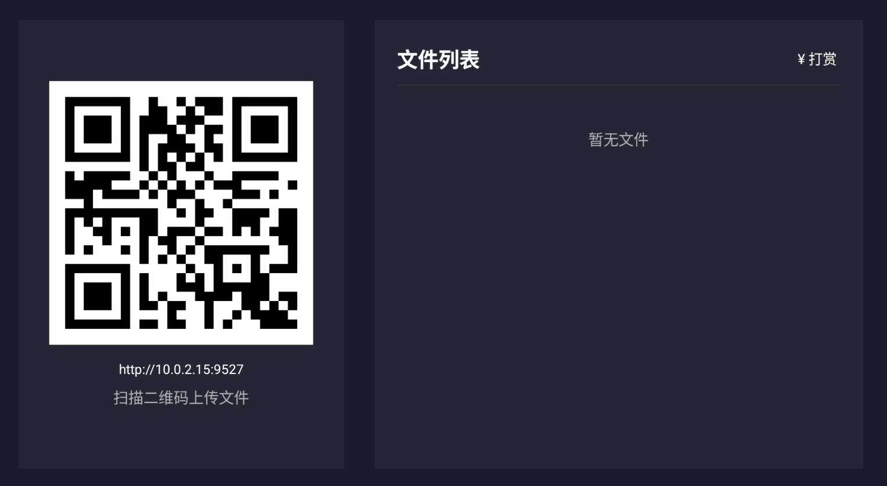
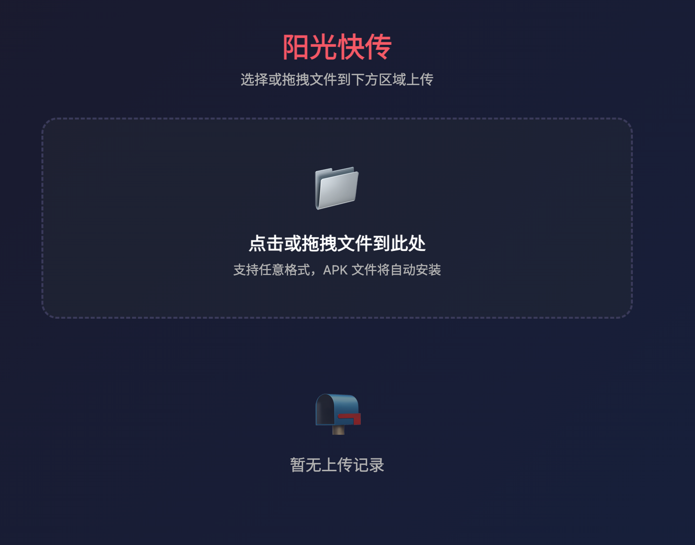
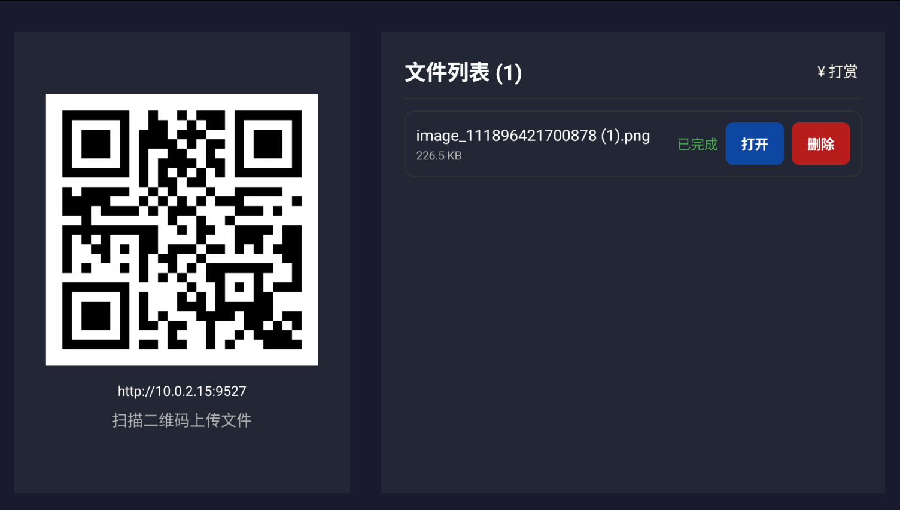

# 阳光快传 (SunshineSend)

一款简洁高效的 Android TV 文件传输工具，让您通过局域网快速将手机或电脑上的文件传送到智能电视。

## 项目背景

在智能电视使用场景中，经常需要将手机或电脑上的文件（视频、图片、文档等）传送到电视上查看。传统方式往往需要 U 盘拷贝或复杂的网络配置。阳光快传提供了一个零配置、开箱即用的解决方案——只需在同一局域网内，通过浏览器即可轻松上传文件到电视。

## 功能特性

- **零配置启动**：应用启动后自动生成服务，无需任何设置
- **扫码即传**：手机扫描二维码即可打开上传页面
- **任意格式**：不限制文件格式，支持所有类型文件
- **实时进度**：Web 端和 TV 端同步显示上传进度
- **APK 自动安装**：上传 APK 文件后自动弹出安装流程
- **文件管理**：支持打开文件（调用系统默认应用）和删除文件
- **持久化存储**：文件列表自动保存，重启后依然显示
- **遥控器支持**：完整的 D-pad 导航支持，适配电视遥控器
- **打赏支持**：内置支付宝和微信收款码，支持开发者

## 使用方式

### 1. 安装并启动

在 Android TV 上安装并启动应用，屏幕左侧显示服务地址二维码，右侧显示已接收文件列表。

### 2. 传输文件

- 使用手机浏览器扫描电视上的二维码
- 在打开的 Web 页面上选择或拖拽文件上传
- 上传过程中电视和 Web 端同步显示进度

### 3. 管理文件

- **打开文件**：遥控器选择文件后点击"打开"，调用系统默认应用
- **删除文件**：选择文件后点击"删除"，文件将从列表和存储中移除

### 4. 端口转发（开发者调试）

如需在本地电脑调试 Web 页面：

```bash
adb forward tcp:9527 tcp:9527
```

然后浏览器访问 `http://localhost:9527`

## 技术架构

| 组件 | 技术 |
|------|------|
| 平台 | Android TV (minSdk 21, Android 5.0+) |
| HTTP 服务器 | NanoHTTPD 2.3.1 |
| 二维码生成 | ZXing 3.5.3 |
| 数据持久化 | SharedPreferences + Gson |
| 文件共享 | FileProvider |

## 项目结构

```
sunshinesend/
├── app/
│   ├── src/main/
│   │   ├── java/com/sunshinesend/app/
│   │   │   ├── MainActivity.kt         # 主界面
│   │   │   ├── SimpleServer.kt         # HTTP 服务器
│   │   │   ├── FileAdapter.kt          # 文件列表适配器
│   │   │   ├── QrCodeUtil.kt           # 二维码生成
│   │   │   ├── PortUtil.kt             # 获取局域网 IP
│   │   │   └── ApkInstaller.kt         # APK 安装
│   │   └── res/
│   │       ├── layout/                 # 界面布局
│   │       ├── drawable/               # 图片资源
│   │       └── raw/index.html          # Web 上传页面
│   └── build.gradle.kts
├── screenshots/                         # 应用截图
│   ├── alipay.png                       # 支付宝收款码
│   ├── wechat.png                       # 微信收款码
│   ├── 1.png                            # 主界面截图
│   ├── 2.png                            # 文件列表截图
│   └── 3.png                            # 文件列表截图
├── build.gradle.kts
├── settings.gradle.kts
└── README.md
```

## 打赏

如果这个项目对您有帮助，欢迎请开发者喝杯咖啡 ☕

| 支付宝 | 微信 |
|--------|------|
|  |  |

## 应用截图

| 主界面 | WEB界面                      | 文件列表                       |
|--------|----------------------------|----------------------------|
|  |  |  |

## License

MIT License
